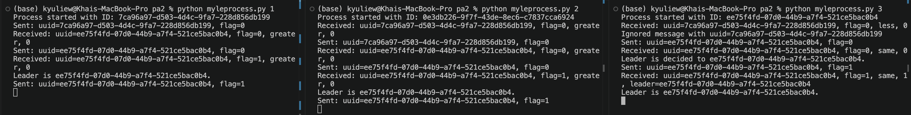

# Local Instructions
To run processes, simply go to the pa2 directory and run the python process in each of the three terminals. Execution examples can be found in the following section.
```bash
cd pa2
python myleprocess.py <process_number: 1 - 3>
```

# Execution examples



## 1st terminal
```bash
python myleprocess.py 1
Process started with ID: 7ca96a97-d503-4d4c-9fa7-228d856db199
Sent: uuid=7ca96a97-d503-4d4c-9fa7-228d856db199, flag=0
Received: uuid=ee75f4fd-07d0-44b9-a7f4-521ce5bac0b4, flag=0, greater, 0
Sent: uuid=ee75f4fd-07d0-44b9-a7f4-521ce5bac0b4, flag=0
Received: uuid=ee75f4fd-07d0-44b9-a7f4-521ce5bac0b4, flag=1, greater, 0
Leader is ee75f4fd-07d0-44b9-a7f4-521ce5bac0b4.
Sent: uuid=ee75f4fd-07d0-44b9-a7f4-521ce5bac0b4, flag=1
```

## 2nd terminal
```bash
python myleprocess.py 2
Process started with ID: 0e3db226-9f7f-43de-8ec6-c7837cca6924
Received: uuid=7ca96a97-d503-4d4c-9fa7-228d856db199, flag=0, greater, 0
Sent: uuid=7ca96a97-d503-4d4c-9fa7-228d856db199, flag=0
Received: uuid=ee75f4fd-07d0-44b9-a7f4-521ce5bac0b4, flag=0, greater, 0
Sent: uuid=ee75f4fd-07d0-44b9-a7f4-521ce5bac0b4, flag=0
Received: uuid=ee75f4fd-07d0-44b9-a7f4-521ce5bac0b4, flag=1, greater, 0
Leader is ee75f4fd-07d0-44b9-a7f4-521ce5bac0b4.
Sent: uuid=ee75f4fd-07d0-44b9-a7f4-521ce5bac0b4, flag=1
```

## 3rd terminal
```bash
python myleprocess.py 3
Process started with ID: 114f5f05-3ef3-4050-95ec-ec4cef920c28
Process started with ID: ee75f4fd-07d0-44b9-a7f4-521ce5bac0b4
Received: uuid=7ca96a97-d503-4d4c-9fa7-228d856db199, flag=0, less, 0
Ignored message with uuid=7ca96a97-d503-4d4c-9fa7-228d856db199
Sent: uuid=ee75f4fd-07d0-44b9-a7f4-521ce5bac0b4, flag=0
Received: uuid=ee75f4fd-07d0-44b9-a7f4-521ce5bac0b4, flag=0, same, 0
Leader is decided to ee75f4fd-07d0-44b9-a7f4-521ce5bac0b4.
Sent: uuid=ee75f4fd-07d0-44b9-a7f4-521ce5bac0b4, flag=1
Received: uuid=ee75f4fd-07d0-44b9-a7f4-521ce5bac0b4, flag=1, same, 1, leader=ee75f4fd-07d0-44b9-a7f4-521ce5bac0b4
Leader is ee75f4fd-07d0-44b9-a7f4-521ce5bac0b4.
```

# For in-class demo:
Block the timer.sleep(2) line in the startup() method and unblock the input line for the in-class demo.